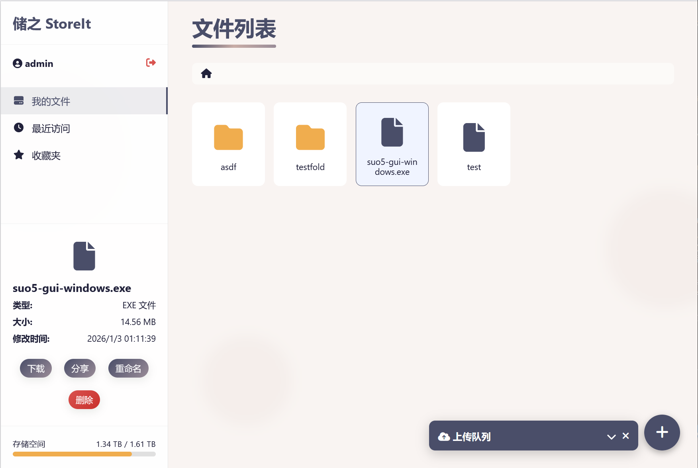

# StoreIt | 储之 — 文件服务应用 
中文 | [English](./README-EN.md)

一个基于 Spring Boot 3（JDK 21）、SQLite 的轻量级文件存储与分享服务。支持登录会话、文件浏览/上传/下载、分享直链、基础安全头、可选 HTTPS，以及通过外部配置文件管理默认管理员账号。



[更新日志](./Version.md)

核心默认配置：
- 端口：59898
- 数据库：`./data/storeit.db`（自动创建）
- 存储根目录：`./storage/`
- 默认管理员：`admin / authorized_users`（可通过外部配置覆盖）

## 功能一览
- UI 页面：`/`、`/login`、`/list`（未登录访问云盘页面会由服务端直接重定向到 `/login`）
- 认证与会话：`POST /api/login`、`POST /api/logout`、`GET /api/user/status`
- 文件：`GET /api/files?path=...`、`POST /api/upload`（multipart）、受保护下载 `GET /storage/**`
- 在线预览：`GET /api/preview?path=...`，内联返回图片 / 视频 / 纯文本，视频支持 HTTP Range 拖动定位
- 分享直链：`POST /api/share` 生成分享，公开下载 `GET /d/{token}`（下载次数原子扣减，并发下不会超额）
- 存储用量：`GET /api/storage/usage`；普通用户展示个人目录实际占用与配额，管理员展示整盘容量
- 安全：会话 Cookie 设置 `HttpOnly` / `SameSite=Lax`（启用 HTTPS 时附加 `Secure`）；`Content-Security-Policy` 与 `X-Content-Type-Options`、`X-Frame-Options`、`Referrer-Policy` 等响应头；`Strict-Transport-Security` 仅在 HTTPS 下下发；路径安全检查，防目录穿越
- 配置：支持在 `src/main/resources/application.yml` 中配置；支持加载外部 `./config/admin.yml` 覆盖默认管理员凭据

## 快速开始
前置要求：JDK 21、Maven

- 构建：`mvn -DskipTests package`
- 运行：`java -jar target/storeit-1.3.2.jar`

可选：在 `src/main/resources/application.yml` 调整配置；或通过外部文件覆盖（适用于发布 JAR 部署）：

1) 复制示例到本地配置目录：
	- `cp config/application.yml.example config/application.yml`
	- `cp config/admin.yml.example config/admin.yml`
2) 按需修改 `config/*.yml`，然后运行 jar。应用会自动读取 `./config/application.yml` 与 `./config/admin.yml`。

### 外部管理员凭据（推荐）
本项目通过 Spring Boot `spring.config.import` 支持从外部文件加载管理员用户名/密码，避免在仓库中存放明文：

- 外部文件路径：`./config/admin.yml`
- 示例内容：

```
app:
	default-admin:
		username: admin
		password: your_secret_here
```

`application.yml` 已配置：
```
spring:
	config:
		import:
			- optional:file:./config/application.yml
			- optional:file:./config/admin.yml
```
仓库的 `.gitignore` 已忽略实际的 `config/*.yml`（保留 `*.example`），适合直接携带 release JAR 进行外部配置。

> ⚠️ **安全建议（务必修改默认凭据）**
> 内置默认管理员 `admin / authorized_users` 仅为「开箱即用」，**严禁在生产/公网环境直接使用**。
> 部署前请通过外部配置覆盖为强口令，应用启动时会自动用新口令重算 BCrypt 哈希并同步到数据库：
>
> ```
> # config/admin.yml
> app:
>   default-admin:
>     username: your_admin
>     password: <一段足够长的随机口令>
> ```
>
> 补充加固建议：
> - **启用 HTTPS**：在 `config/application.yml` 配置 `server.ssl.*` 并设 `app.ssl-enabled: true`，会话 Cookie 会自动附加 `Secure`，并下发 HSTS。
> - **置于反向代理之后**：由 Nginx/Caddy 终止 TLS 并按需做登录限流，弥补应用层暂未内置的登录速率限制。
> - **设置用户配额**：普通用户的 `storage_quota`（字节，0=不限额）可用于约束单用户占用空间。

### 路由与 API 说明
- 页面：
	- `GET /` -> `static/index.html`
	- `GET /login` -> `static/login.html`
	- `GET /list` -> `static/list.html`
- 认证：
	- `POST /api/login`（表单：username、password）
	- `POST /api/logout`
	- `GET /api/user/status`
- 文件：
	- `GET /api/files?path=...` — 列出目录内容
	- `POST /api/upload` — 上传文件（multipart/form-data，字段名：file，可选 directory）
	- `GET /storage/**` — 已登录受保护下载（`attachment`）
	- `GET /api/preview?path=...` — 已登录内联预览（`inline`，图片/视频/纯文本，视频支持 Range）
	- `POST /api/file/delete`、`POST /api/file/rename`、`POST /api/folder/create` — 删除 / 重命名 / 新建文件夹
	- `GET /api/storage/usage` — 存储用量（普通用户=个人占用/配额，管理员=整盘）
- 分享：
	- `POST /api/share` — 生成分享链接（请求体：`{"filePath":"...","expireHours":720,"maxDownloads":null}`，`expireHours=-1` 为永久）
	- `GET /d/{token}` — 公开下载（受有效期/下载次数限制，次数原子扣减）

### 数据库存储
- SQLite 数据库：`./data/storeit.db`
- 表：`users`、`sessions`、`file_shares`（初始由 Flyway `V1__init.sql` 创建）
- 启动时会确保默认管理员存在；若配置中密码变更，会同步更新其哈希

### HTTPS 与安全
- 支持在 `server.ssl.*` 配置中启用证书（见 `application.yml` 注释）
- 全局安全响应头通过 `SecurityHeadersFilter` 添加
- 路径安全检查与登录拦截通过 `AuthInterceptor`、`FileService.isSafePath` 实现

### 目录结构（关键部分）
- `storage/` — 文件存储根目录
- `src/main/resources/static/` — 静态资源（前端页面与脚本）
- `src/main/resources/db/migration/` — Flyway SQL 脚本
- `config/admin.yml` — 外部管理员配置（不入库）

### 从旧 Python 版本迁移
- 旧版基于 Flask + IP 白名单；新版改为 登录会话 + SQLite + Spring Boot 3
- 不再使用 `config.json` 与 `ip_whitelist.json`；改用 `application.yml` 与数据库
- HTTPS 配置方式变化：参考 Spring Boot SSL 配置；支持 PKCS12 keystore

---

